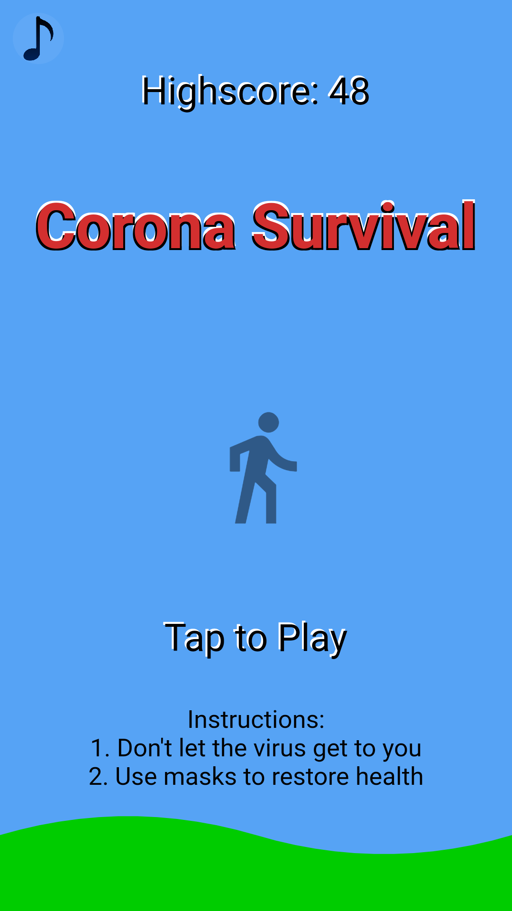
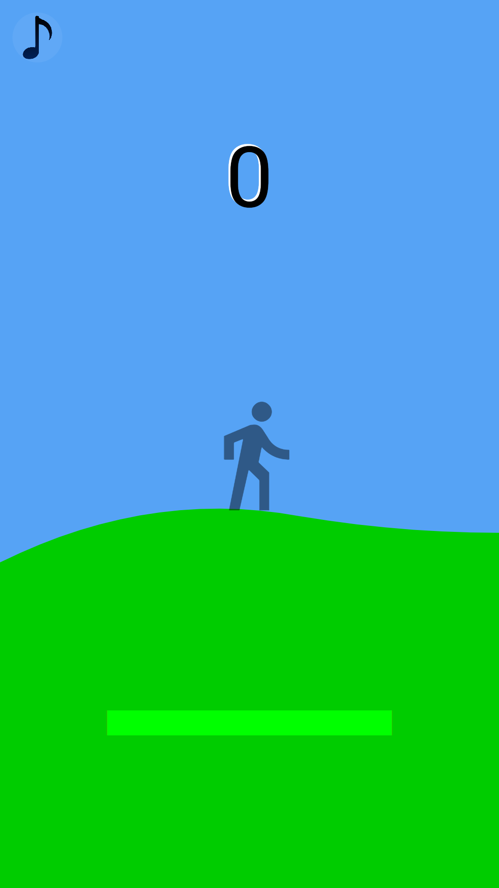
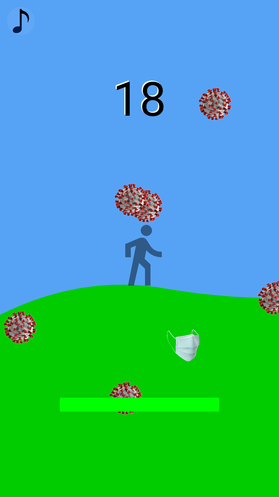
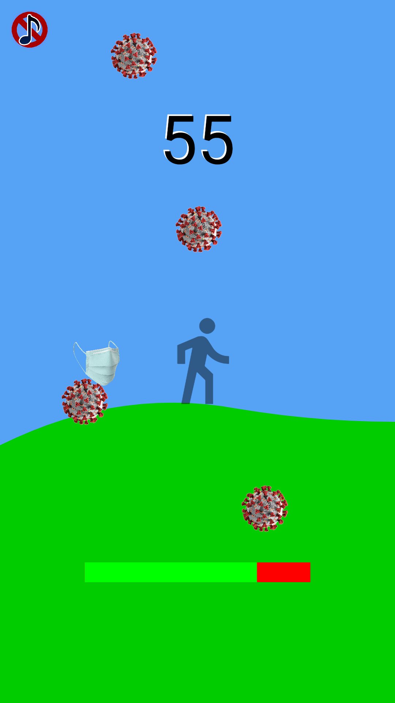
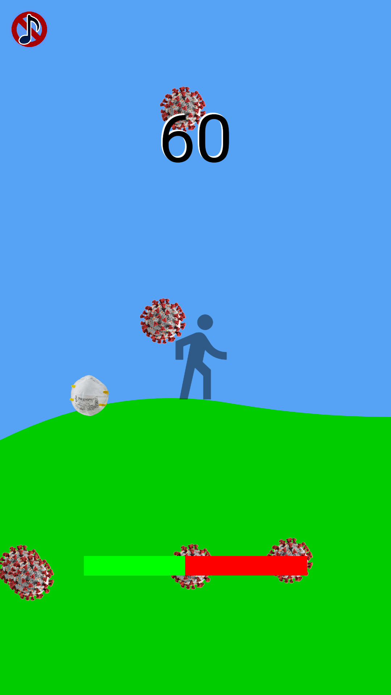
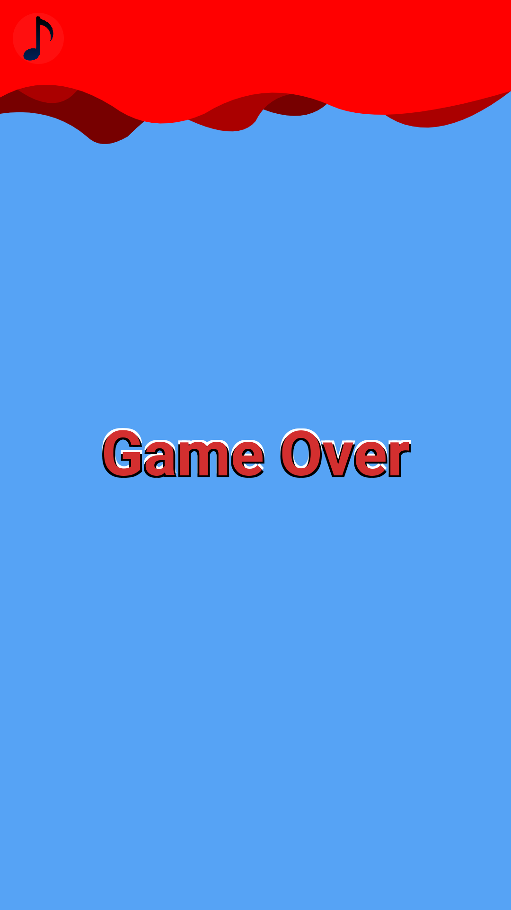

Flutter 2D Survival Game Using Flame - Fazil Shaikh
---

## Game Title - Corona Survival

In a world facing a pandemic, defend yourself against waves of the virus that has shaken the world order! Tap the virus to get rid of them before they to you. Use masks to regain some of your health. Be careful though, the virus can come from all directions and the game gets progressively harder the longer you survive. Compete for highscores and enjoy the soundtrack. **Corona Survival** is not meant to be taken seriously as is simply a fun game for everyone! 

## Basic gameplay instructions

Main Menu:
- Tap anywhere on the screen to start the game
- View the current highscore on the top of the menu
> **Note:** Clicking on the music icon on the top left does not start the game.

Playing:
- Tap on virus to defeat it
- Tap on the masks to regain health
- The score on the top increases when you defeat a virus
- Don't let the virus near you for too long as they will reduce your health
- When your health reaches zero, you are taken to the game over screen
> **Note:**  The gameplay gets progressively harder so prepare for a larger waves the longer you survive

Gameover:
- Tap on the screen to get back to the main menu
> **Note:** By default the game over screen directs you back to main menu after three seconds

## Lessons learned

From this project, I learned that when you have a idea about something you are really interested in making, you should just do it. I really liked using Flutter and the Flame game engine to build this small game. It didn't take me too long to understand all the different functionalities the game engine has to offer and the rest was just researching as I developed the game. Flame offers a nice set of features for 2D games. It's nothing like game design in Unity or Unreal but it was simple to use and had everything I needed to bring this project to life. This is a first draft product and with more time I would have added extra screens and separate dialog boxes for instructions, highscores, and perhaps even a profile page for users. For now this will do. I enjoyed coding in Dart (simple but powerful) and Flutter's organized layout, ability to hot reload, and its own UI drawing tool made it a great overall sdk to work with.

## Demo

## Screenshots

